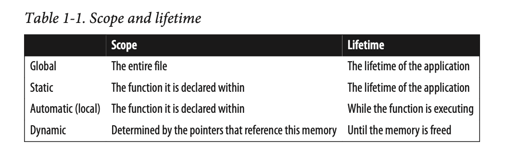
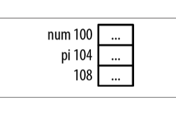
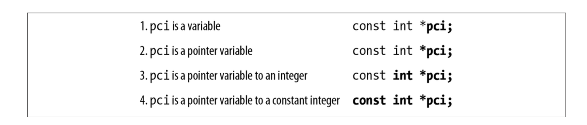
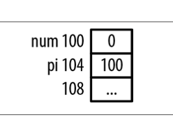

# Pointers in C - Introduction

## Table of Contents

* [Introduction](#introduction)
* [C and Memory](#c-and-memory)
* [C behaviors](#c-behaviors)
* [Pointer Declaration](#pointer-declaration)
    * [Reading a declaration](#reading-a-declaration)

## Introduction

Please remember this one thing:

A **pointer** is a **variable** that **stores the address of a memory location.**

The key to understanding pointers is to **understand how memory is managed** in a C program.

Most **pointers are used to manipulate data in memory**. A pointer variable contains the address in memory of another variable, object, or function.

A pointer is normally declared to be of a specific type depending on what it points to, however **there is nothing inherent in a pointer that indicates what type of data the pointer is referencing**. A pointer only contains an address

## C and Memory

When a C program is compiled, it works with three types of memory:



1. **Static/Global** - Statically declared variables are allocated to this type of memory. Global variables also use this region of memory. They are allocated when the program starts and remain in existence until the program terminates. While all functions have access to global variables, the scope of static variables is restricted to their defining functions.
2. **Automatic** - These variables are declared within a function and are created when a function is called. Their scope is restricted to the function, and their lifetime is limited to the time the function is executing.
3. **Dynamic** - **Memory is allocated from the heap** and can be released as necessary. A pointer references the allocated memory. **The scope is limited to the pointer or pointers that reference the memory**. It exists until released.

## Why use Pointers?

Faster and more efficient code can be written because pointers are closer to the hardware. 

Many data structures are easily implemented using pointers.


With a linked list, pointer are easier to use and map directly to a previous link. An array implementation requires array indexes that are not as intuitive or flexible as pointers. 

## C Behaviors

1. **Implementation Defined** - Some specific, documented implementation is provided.
2. **Unspecified** - Some implementation is provided but it is not documented.
3. **Undefined** - There are no requirements imposed and anything can happen. An example of undefined behavior is the value of a pointer deallocated by the free functions.

## Declaring Pointers

Pointer variables are declared using a data type followed by an asterisk and then the pointer's variable's name.

```c
int num; //int variable
int *pi; //pointer to int
```

Whitespace is a matter of user preference. All of the following are equivalent.

```c
int* pi;
int * pi;
int *pi;
int*pi;
```

The asterisk declares the variable as a pointer. It is an overloaded symbol as it is also used for multiplication and dereferencing a pointer.

Let's go back to our previous example with num, and pi.

```c
int num; //int variable
int *pi; //pointer to int
```



This figure illustrates how memory would typically be allocated for the above declarations. The number to the left of each rectangle is its address. The three dots represent uninitialized memory.

**Pointers to uninitialized memory can be a problem!** If such a pointer is dereferenced, the pointer's content probably does not represent a valid address, and if it does, may not contain valid data. An invalid address is one that the program is not authorized to access.

The variables num and pi are located at address 100 and 104. Both are assumed to occupy four bytes. Both of these sizes will differ, depending on the system configuration.

* The content of pi should be assigned the address of an integer variable.
* These variables have no been initialized and thus contain meaningless data.

## Reading a declaration

The trick to reading pointer declaration is to read them backwards. Take the following declaration:

```c
const int *pci;
```



## Address of Operator

The address of operator, `&`, will return its operand's address. We can initialize the pi pointer with the address of num using this operator as follows:

```c
int num = 0;
int *pi = &num;
```



It is **good practice to initialize a pointer as soon as possible**.

```c
int num;
int *pi;
pi = &num;
```

## Displaying Pointer Values