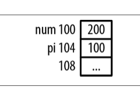
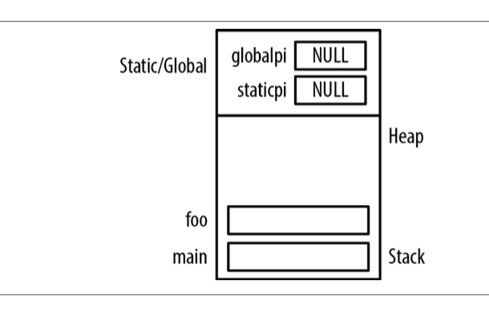
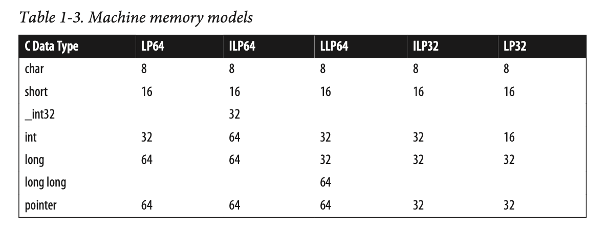
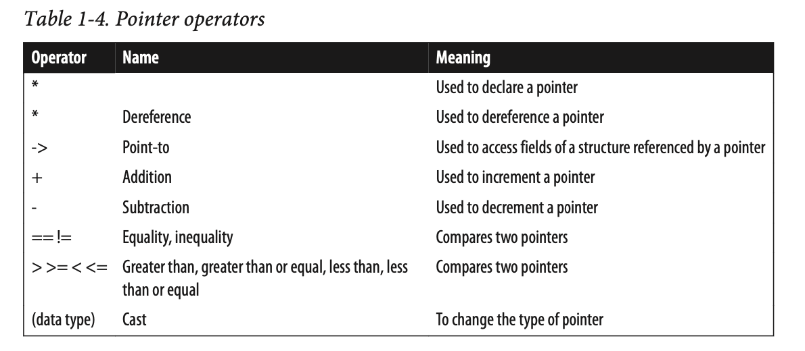
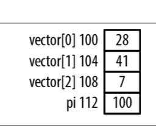
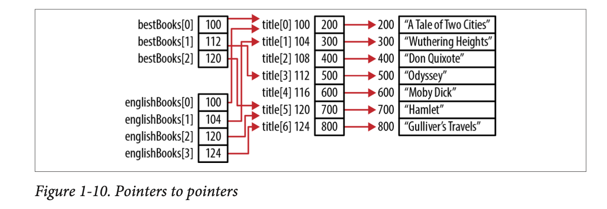
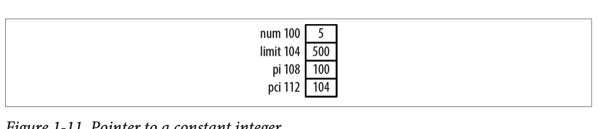

# Pointers in C - Introduction

## Table of Contents

* [TLDR](#tldr)
* [Introduction](#introduction)
* [Pointers and Memory](#c-and-memory)
    * [C and Memory](#c-and-memory)
    * [C behaviors](#c-behaviors)
    * [Pointer Declaration](#declaring-a-pointer)
        * [Reading a declaration](#reading-a-declaration)
    * [Address of Operator: &](#address-of-operator)
    * [Displaying Pointer Values](#displaying-pointer-values)
    * [Dereferencing a Pointer using the Indirection Operator: *](#dereferencing-a-pointer-using-the-indirection-operator)
    * [The concept of NULL](#the-concept-of-null)
    * [Pointer to void](#pointer-to-void)
* [Pointer Size and Types](#pointer-size-and-types)
    * [Pointer-related types](#pre-defined-pointer-related-types)
* [Common uses of Pointers](#common-uses-of-pointers)
    * [Indirection](#multiple-levels-of-indirection)
    * [Constants and Pointers](#constants-and-pointers)

## TLDR 

A **pointer** is a **variable** that **stores the address of a memory location.**

Most **pointers are used to manipulate data in memory**.

* The address of operator, `&`, will return its operand's address.

* The **indirection operator**, `*`, **returns the value pointed to by a pointer variable**. This is frequently referred to as **dereferencing** a pointer.

* When **NULL is assigned to a pointer**, it means the **pointer does not point to anything**.

* A **pointer to void** is a general-purpose pointer **used to hold references to any data type**.

Four predefined types are frequently used when working with pointers.

1. `size_t` - Created to provide a safe type for sizes. 
2. `ptrdiff_t` - Created to handle pointer arithmetic
3. `intptr_t\uintptr_t` -  Used for storing pointer addresses.


## Introduction

Please remember this one thing:

A **pointer** is a **variable** that **stores the address of a memory location.**

The key to understanding pointers is to **understand how memory is managed** in a C program.

Most **pointers are used to manipulate data in memory**. A pointer variable contains the address in memory of another variable, object, or function.

A pointer is normally declared to be of a specific type depending on what it points to, however **there is nothing inherent in a pointer that indicates what type of data the pointer is referencing**. A pointer only contains an address.

### C and Memory

When a C program is compiled, it works with three types of memory:


1. **Static/Global** - Statically declared variables are allocated to this type of memory. Global variables also use this region of memory. They are allocated when the program starts and remain in existence until the program terminates. While all functions have access to global variables, the scope of static variables is restricted to their defining functions.
2. **Automatic** - These variables are declared within a function and are created when a function is called. Their scope is restricted to the function, and their lifetime is limited to the time the function is executing.
3. **Dynamic** - **Memory is allocated from the heap** and can be released as necessary. A pointer references the allocated memory. **The scope is limited to the pointer or pointers that reference the memory**. It exists until released.

## Why use Pointers?

Faster and more efficient code can be written because pointers are closer to the hardware. 

Many data structures are easily implemented using pointers.


With a linked list, pointer are easier to use and map directly to a previous link. An array implementation requires array indexes that are not as intuitive or flexible as pointers. 

### C Behaviors

1. **Implementation Defined** - Some specific, documented implementation is provided.
2. **Unspecified** - Some implementation is provided but it is not documented.
3. **Undefined** - There are no requirements imposed and anything can happen. An example of undefined behavior is the value of a pointer deallocated by the free functions.

### Declaring Pointers

Pointer variables are declared using a data type followed by an asterisk and then the pointer's variable's name.

```c
int num; //int variable
int *pi; //pointer to int
```

Whitespace is a matter of user preference. All of the following are equivalent.

```c
int* pi;
int * pi;
int *pi;
int*pi;
```

The asterisk declares the variable as a pointer. It is an overloaded symbol as it is also used for multiplication and dereferencing a pointer.

Let's go back to our previous example with num, and pi.

```c
int num; //int variable
int *pi; //pointer to int
```


This figure illustrates how memory would typically be allocated for the above declarations. The number to the left of each rectangle is its address. The three dots represent uninitialized memory.

**Pointers to uninitialized memory can be a problem!** If such a pointer is dereferenced, the pointer's content probably does not represent a valid address, and if it does, may not contain valid data. An invalid address is one that the program is not authorized to access.

The variables num and pi are located at address 100 and 104. Both are assumed to occupy four bytes. Both of these sizes will differ, depending on the system configuration.

* The content of pi should be assigned the address of an integer variable.
* These variables have no been initialized and thus contain meaningless data.

### Reading a declaration

The trick to reading pointer declaration is to read them backwards. Take the following declaration:

```c
const int *pci;
```


### Address of Operator

The address of operator, `&`, will return its operand's address. We can initialize the pi pointer with the address of num using this operator as follows:

```c
int num = 0;
int *pi = &num;
```


It is **good practice to initialize a pointer as soon as possible**.

```c
int num;
int *pi;
pi = &num;
```

### Displaying Pointer Values

Rarely will the values we use actually have nice clean addresses like 100 and 104. The address can be determined by printing it out.

```c
int num = 0;
int *pi = &num;

printf("Address of num: %d, Value: %d\n", &num, num);
printf("Address of pi: %d, Value: %d\n", &pi, pi);
```

Running the following code returns:

```bash
$ gcc -o display_p display_pointer.c
$ ./display_p                                                                    
Address of num: -310567156, Value: 0
Address of pi: -310567168, Value: -310567156
```


The %p specifier differs from %x in that it typically displays the hexadecimal number in uppercase. We will use %p for addresses unless otherwise specified.

### Virtual Memory and Pointers

To further complicate displaying addresses, the pointer addresses returned are not likely to be real physical memory addresses. Each program assumes is has access to the entire machine's physical memory space. In reality, it doesn't. **The address used by a program is a virtual address**. The OS maps the virtual address to a real physical memory address when needed.

### Dereferencing a Pointer using the Indirection Operator (*)

The **indirection operator**, `*`, **returns the value pointed to by a pointer variable**. This is frequently referred to as **dereferencing** a pointer. 

```c
int num = 5;
int *pi = &num;
printf("%p\n", *pi); //displays 5
*pi = 200;
printf("%d\n", num); //displays 200
```



We can use the result of the dereference operator as an **lvalue**. The term lvalue refers to the operand found on the left side of the assignment operator. All lvalues are modifiable since they are being assigned a value.

### The Concept of Null

The concept of null is often misunderstood. Why? Because all the following are distinct:
* The null concept
* The null pointer constant
* The NULL macro
* The ASCII NUL
* A null string
* The null statement

Yikes!

When **NULL is assigned to a pointer**, it means the **pointer does not point to anything**. 

The NULL macro is a constant integer zero cast to a pointer to void.

```c
 #define NULL    ((void *)0)
```

The ASCII NUL is defined as a byte containing all zeros. However, this is not the same as a null pointer. A string in C is represented as a sequence of characters terminated by a zero value. The null string is an empty string and does not contain any characters. Finally, the null statement consists of a statement with a single semicolon.

The null pointer is a very useful feature for many data structure implementations, such as a linked list where it is often used to mark the end of the list.

**A null pointer and an uninitialized pointer are different**. An uninitialized pointer can contain any value, whereas a pointer containing NULL does not reference any location in memory.

*Which is better form, using NULL or 0 when working with pointers?* Either is acceptable, but some developers prefer to use NULL because it is a reminder that we are working with pointers.

### Pointer to void

A **pointer to void** is a general-purpose pointer **used to hold references to any data type**.

Any pointer can be assigned to a pointer to void. It can then be cast back to its original pointer type. When this happens the value will be equal to the original pointer value. 

```c
int num;
int *pi = &num;
printf("Value of pi: %p\n", pi); 
void* pv = pi; // assigned to pointer to void
pi = (int*) pv; // assigned back to a pointer to an int
printf("Value of pi: %p\n", pi);
```
### global and static pointers

If a pointer is declared as [global or static](#c-and-memory), it is initialized to NULL when the program starts. 

```c
int *globalpi;

void foo() {
    static int *staticpi;
}

int main() {
    foo();
}

```



Static and global variables are frequently placed in a data segment separate from the data segments used by the heap and the stack.

## Pointer Size and Types

Pointer size is an issue when we are thinking about application compatibility and portability. On most modern platforms, the size of a pointer to data is the same regardless of pointer type. The one gotcha is that the size of a pointer to a function may be different from the size of a pointer to data.

### Memory Models

The introduction of 64-bit machines has made more apparent the differences in size of memory allocated for data types. I, L, and P refer to an integer, long and pointer respectively.



The model used depends on the OS and the compiler. More than one model may be supported by the same OS.

### Pre-defined pointer-related types

Four predefined types are frequently used when working with pointers.

1. `size_t` - Created to provide a safe type for sizes. 
2. `ptrdiff_t` - Created to handle pointer arithmetic
3. `intptr_t\uintptr_t` -  Used for storing pointer addresses.

Let's look at `size_t`. This type represents the maximum size any object can be in C. It is an unsigned integer. Its **purpose is to provide a portable means of declaring a size consistent with the addressable area of memory available in the system**.

`size_t` is used as the return type for the `sizeof()` operator and as the argument to many functions, including `malloc` and `strlen`.

It is good practice to use `size_t` when **declaring variables for sizes such as the number of characters and array indexes**. It should be used for loop counters, indexing into arrays and sometimes for pointer arithmetic.

The declaration of `size_t` is implementation-specific. It is found in one or more standard headers (stdio.h, stdlib.h) and is typically defined as follows:

```c
#ifndef __SIZE_T
#define __SIZE_T
typedef unsigned int size_t; #endif
#endif
```

The define directive ensures it is only defined once. The actual size will depend on the implementation (32-bit system or 64-bit system)

Be careful when printing values defined as `size_t`, they are unsigned values and if you choose the wrong format specifier, you will get unreliable results. The recommended specifier is `%zu`.

### Using sizeof with pointers

The `sizeof` operator can be used to determine the size of a pointer.

```c
printf("Size of *char: %d\n", sizeof(char*));
```

The **size of a function pointer can vary**. Usually it is consistent for a given OS and compiler combination. 

### Using intptr_t and uintptr_t

The types `intptr_t` and `uintptr_t` are **used for storing pointer addresses**. They provide a **portable and safe way of declaring pointers**, and will be the same size as the underlying pointer used on the system. They are useful for converting pointers to their integer representation.

For most operations, `intptr_t` is preferred, `uintptr_t` is the unsigned version of `intptr_t`.

## Pointer Operators



### Pointer Arithmetic

Several arithmetic operations are performed on pointers to data. These include adding an integer to a pointer, subtracting an integer from a pointer, subtracting two pointers from each other, and comparing pointers.

### Adding an integer to a pointer

This operation is very common and useful. When we add an integer to a pointer, **the amount added is the product of the integer times the number of bytes underlying the data type**.

The size of primitive types can [vary from system to system](#memory-models). However, here are the common sizes.


```c
int vector[] = {28, 41, 7};
int *pi = vector;       // pi: 100

printf("%d\n", *pi);    // Displays: 28
pi += 1;                // pi: 104
printf("%d\n", *pi);    // Displays: 41
pi += 1;                // pi: 108
printf("%d\n", *pi);    // Displays: 7
```

When an array name is used by itself, it returns the address of an array, which is also the address of the first element. 

Let's look at something funky

```c
pi = vector;
pi += 3;
```



The pointer is not pointing at itself. This is not useful, but illustrates the need to be careful when using pointer arithmetic! Accessing memory past the end of an array is dangerous and should be avoided. There is no guarantee that the memory access will be a valid variable.

### Subtracting an integer from a pointer

Integer values can be subtracted from a pointer in the same way that they are added. The **size of the data type times the integer increment value is subtracted from the address**. 

```c
int vector[] = {28, 41, 7};
int *pi = vector + 2;       // pi: 108

printf("%d\n", *pi);        // Displays: 7
pi--;                       // pi: 104
printf("%d\n", *pi);        // Displays: 41
pi--1;                      // pi: 100
printf("%d\n", *pi);        // Displays: 28
```

### Subtracting two pointers

When one pointer is subtracted from another, we get the difference between their addresses (which is not usually useful except for determining the order of elements in the array).

```c
int vector[] = {28, 41, 7};
int *p0 = vector;
int *p1 = vector + 1;
int *p2 = vector + 2;

printf("p2-p0: %d\n",p2-p0); // p2-p0: 2 
printf("p2-p1: %d\n",p2-p1); // p2-p1: 1
printf("p0-p1: %d\n",p0-p1); // p0-p1: -1
```

The type `ptrdiff_t` is a portable way to express the difference between two pointers.

### Comparing Pointers

Pointers can be compared using the standard comparison operators. Usually this isn't very useful, however when comparing pointers to elements of an array, the comparison's results acn be used to determine the relative ordering of the array's elements.

```c
int vector[] = {28, 41, 7};
int *p0 = vector;
int *p1 = vector + 1;
int *p2 = vector + 2;

printf("p2>p0: %d\n",p2>p0); //p2>p0: 1
printf("p2<p0: %d\n",p2<p0); //p2<p0: 0
printf("p0>p1: %d\n",p0>p1); //p0>p1: 0
```

## Common Uses of Pointers

### Multiple levels of indirection

Pointers can be use different levels of indirection. It is not uncommon to see a variable declared as a **pointer to a pointers**, sometimes called a **double pointer**. 

Let's look at an example. The first array is an array of strings used to hold a list of book titles:

```c
char *titles[] = {"A Tale of Two Cities", "Wuthering Heights","Don Quixote", "Odyssey","Moby-Dick","Hamlet", "Gulliver's Travels"};
```

Two additional arrays are provided whose purpose is to maintain a list of the "best books" and English books. Instead of holding copies of the titles, they will hold the address of a title in the titles array.

```c
char **bestBooks[3];
char **englishBooks[4];

bestBooks[0] = &titles[0];
bestBooks[1] = &titles[3];
bestBooks[2] = &titles[5];

englishBooks[0] = &titles[0];
englishBooks[1] = &titles[1];
englishBooks[2] = &titles[5];
englishBooks[3] = &titles[6];

printf("%s\n",*englishBooks[1]); // Wuthering Heights
```



Using multiple levels of indirection provides additional flexibility in how code can be written and used. Certain types of operations would be more difficult. In this example, if we need to change a title, we change it in one place and it is reflected everywhere.

### Constants and Pointers

Using `const` with pointers provides different types of protections for different problem sets.

### Pointer to a constant

A pointer can be defined to point to a constant. This means that the pointer cannot be used to modify the value it is referencing.

```c
int num = 5;
const int limit = 500;
int *pi;
const int *pci;

pi = &num;
pci = &limit;

printf(" num - Address: %p value: %d\n",&num, num); //num - Address: 100 value: 5
printf("limit - Address: %p value: %d\n",&limit, limit); //limit - Address: 104 value: 500
printf(" pi - Address: %p value: %p\n",&pi, pi); //pi - Address: 108 value: 100
printf(" pci - Address: %p value: %p\n",&pci, pci); //pci - Address: 112 value: 104
```



Dereferencing a constant pointer is fine if we are simply reading the integer's value. **We cannot dereference a constant pointer to change what the pointer references, but we can change the pointer**. The pointer value is not constant. The pointer can be changed to reference another constant integer or a simple integer.

The declaration of `pci` as a pointer to a constant integer means:
* `pci` can be assigned to point to different constant integers
* `pci` can be assigned to point to different nonconstant integers
* `pci` can be dereferenced for reading purposes
* `pci` cannot be dereferenced to change what it points to

### Constant pointers to nonconstants

We can also declare a constant pointer to a nonconstant, this means that while the pointer cannot be changed, the data pointed to it can be modified.

```c
int num;
int age;
int *const cpi = &num;

*cpi = 25; //legal
cpi = &age; //not legal, will generate an error
```

With this declaration:
* `cpi` must be initialized to a nonconstant variable
* `cpi` cannot be modified
* the data pointed to by `cpi` can be modified


### Constant pointers to constants

A constant pointer to a constant is an infrequently used pointer type. The pointer cannot be changed and the data it points to cannot be changed through the pointer.