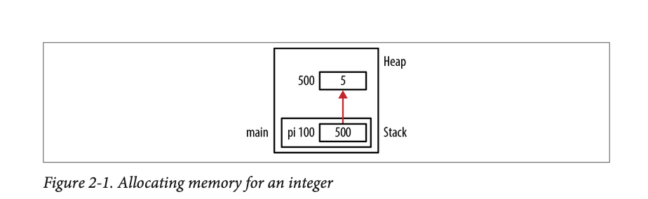
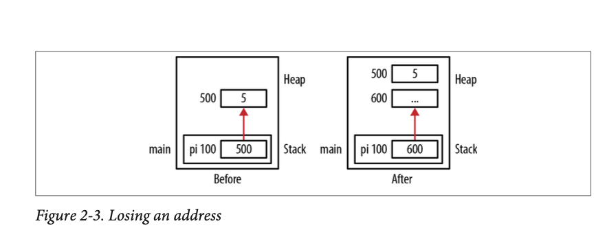
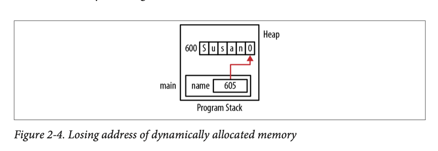
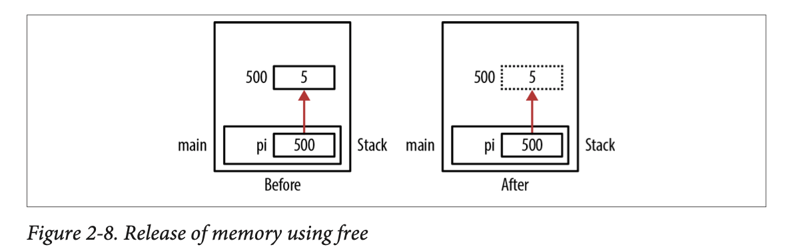
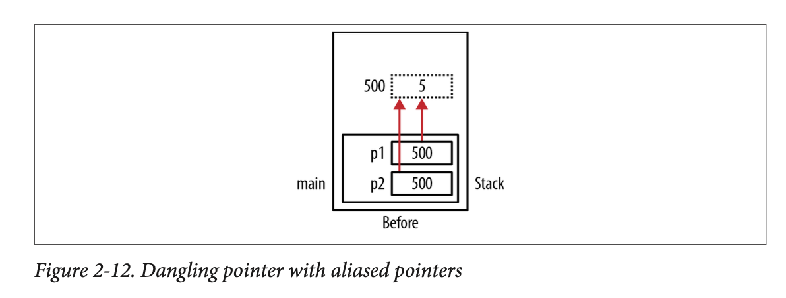

# Pointers in C - Dynamic Memory Management

## Table of Contents

* [Introduction](#introduction)
* [Dynamic Memory Management](#dynamic-memory-management)
    * [Memory Leaks](#memory-leaks)
    * [Hidden Memory Leaks](#hidden-memory-leaks)
* [Dynamic Memory Allocation Functions](#dynamic-memory-allocation-functions)
    * [Using free](#using-the-free-function)
* [The Heap and System Memory](#the-heap-and-system-memory)


## TLDR

## Introduction

Much of the **power of pointers stems from their ability to track dynamically allocated memory**.

A C program executes within a **runtime system**, this is typically the environment provided by the operating system. The runtime supports **the stack and heap** along with other program behavior.

C supports managing objects that are allocated **memory from the heap**. This is **done manually using functions to allocate and deallocate** the memory. This is called **dynamic memory management**.

## Dynamic Memory Allocation

The basic steps for dynamic memory allocation in C are:
1. Use a `malloc` type function to allocate memory.
2. Use the memory.
3. Deallocate the memory using the `free` function.

Seems easy right? 😝 Here is an example:

```c
int *pi = (int*) malloc(sizeof(int));
*pi = 5;
printf("*pi: %d\n", *pi);
free(pi);
```



The `malloc` functions **single argument** specifies the **number of bytes to allocate**. If successful, it will return a pointer to memory allocated from the heap. If it fails, it returns a null pointer. The `sizeof` operator makes the code above more portable.

Each time the `malloc` function is called, a **corresponding call to the `free` function must be made when the application is done with the memory to avoid memory leaks**.

Once memory has been freed, it should not be accessed again. A common practice is to **always assign NULL to a freed pointer**.

When memory is allocated, additional information is stored as part of a data structure maintained by the heap manager. This information includes, among other things, the block's size and is typically placed immediately adjacent to the allocated block. If the application writes outside of this block of memory, then the data structure can be corrupted. Let's look at an example:

```c
char *pc = (char*) malloc(6);
for(int i=0; i<8; i++) {
    *pc[i] = 0;
}
```

Notice we only allocate five characters plus the byte for the NUL termination character. The for loop writes extra memory and corrupts the data structure used for heap management.


### Memory Leaks

Memory leaks occur when allocated memory is not freed. This can happen when:

* The memory's address is lost
* The free function is never invoked

The big problem with memory leaks is that the memory cannot be reclaimed and used later. If memory is repeatedly allocated and then lost, then the program may terminate when more memory is needed but malloc cannot allocate it.

An example of losing the address is below. The address of the first allocation of memory is lost when `pi` is allocated memory a second time.

```c
int *pi = (int*) malloc(sizeof(int));
*pi = 5;
//...
pi = (int*) malloc(sizeof(int));
```



Here's a more subtle one. This code allocates memory for a string, initializes it, and then displays the string character by character. At the end, name is left pointing to the string's NUL termination character and the allocated memory's starting address has been lost.

```c
char *name = (char*) malloc(strlen("Susan") + 1);
strcpy(name, "Susan);
while(*name != 0) {
    printf("%c", *name);
    name++;
}
```



### Hidden Memory Leaks

A hidden memory leak **occurs when an object is kept in the heap even though the object is no longer needed**. Memory leaks can also occur when **freeing structures created using the struct** keyword. If the structure contains pointers to dynamically allocated memory, then these pointers also need to be freed.

## Dynamic Memory Allocation Functions

There are four dynamic memory allocation functions you should now.

1. `malloc` - allocates memory from the heap.
2. `realloc` - reallocates memory to a larger or smaller amount based on a perviously allocated block of memory.
3. `calloc` - allocates and zeros out memory from the heap.
4. `free` - returns a block of memory to the heap. 

So what's with the cast before each of the malloc calls in this section?

```c
int *pi = (int*) malloc(sizeof(int));
```

Before the pointer to void was introduced to C, explicit casts were required with malloc. Some developers consider explicit casts to be a good practice they document the intention of the `malloc` function, and they make the code compatible with C++.

### Using the free function

The programmer is able to return memory allocated by the `malloc` type functions using the free function. The memory is returned to the heap. 

```c
int *pi = (int*) malloc(sizeof(int));
*pi = 5;
//...
free(pi);
```



The dashed box at address 500 indicates the memory has been freed but still may contain its value. The variable pi still contains the address 500, this is called a **dangling pointer**.

Pointers can cause problems even after they have been freed. If we try to dereference a freed pointer, its [behavior is undefined](1_introduction.md#c-behaviors). As a result, some programmers will **explicitly assign NULL to a pointer to designate the pointer as invalid**. Subsequent use of such a pointer will result in a runtime exception.

```c
int *pi = (int*) malloc(sizeof(int));
*pi = 5;
//...
free(pi);
pi = NULL; //designate the pointer as invalid
```

### The Heap and System Memory

The heap typically uses OS functions to manage its memory. The heap's size may be fixed when the program is created, or it may be allowed to grow. However, **the heap manager does not necessarily return memory to the OS when the free function is called**. The deallocated memory is simply made available for subsequent use of the application. Thus when a program allocates and then frees up memory, the deallocation of memory is not normally reflected in the application's memory footprint as seen from the OS perspective.

### Freeing memory at program termination

The OS is responsible for maintaining the resources of an application, including memory. When an application terminates, it is the OS's responsibility to reallocate this memory for other applications.

The state of the memory, corrupted, uncorrupted doesn't matter. The OS will just give it to someone else. So while it is good form to free up memory, sometimes it is painful and programmer's don't do it because they are lazy, especially if the program isn't long running.

### Dangling Pointers

```c
int *p1 = (int*) malloc(sizeof(int));
*p1 = 5;
//...
int *p2;
p2 = p1;
//...
free(p1);
//...
*p2 = 10; //dangling pointer
```



So how should we deal with dangling pointers?

1. Setting a pointer to NULL after freeing it. Its subsequent use will terminate the application.