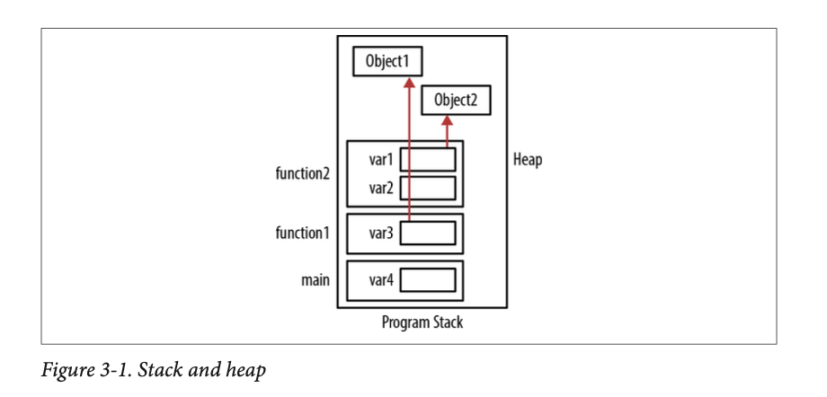
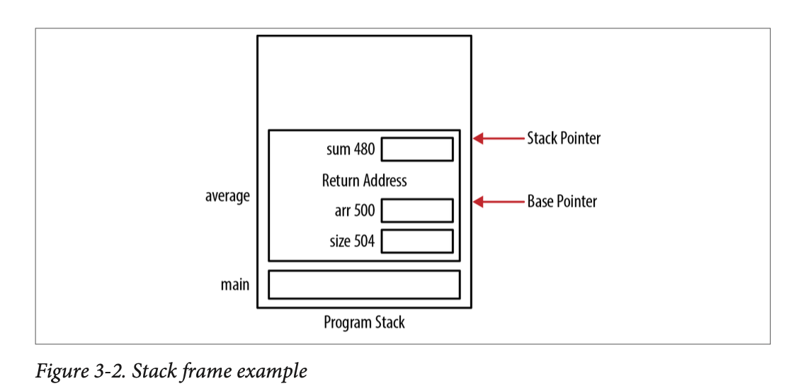
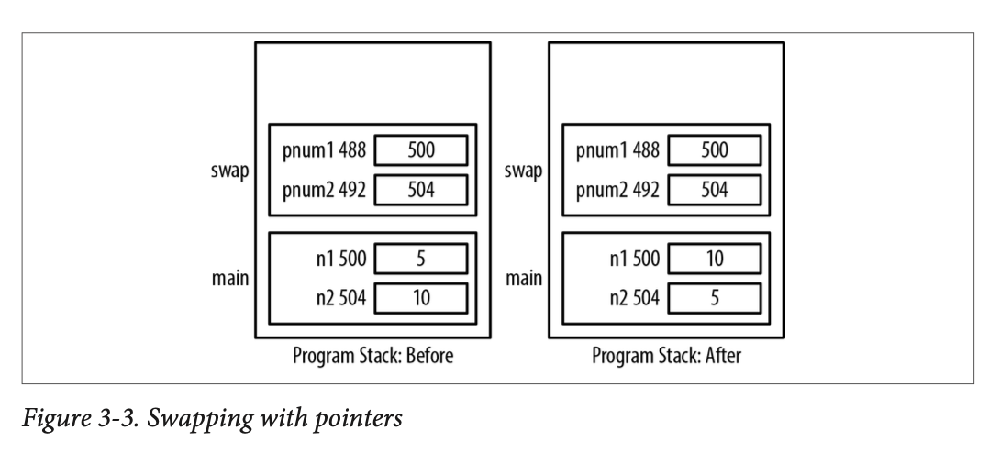
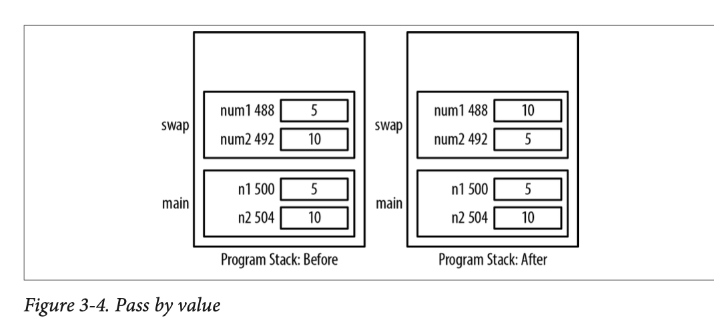
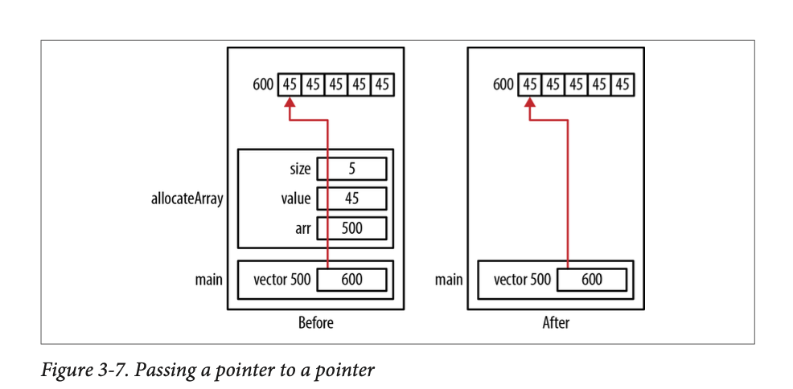

# Pointers in C - Pointers and Functions

## Table of Contents

* [Introduction]()
* [Program Stack and Heap]()
    * [ Organization of Stack Frame]()
* [Passing and Returning by Pointer]()

### Introduction

Pointers allow data to be passed and modified by a function. Complex data can also be passed and returned from a function in the form of a pointer to a struct. When pointers hold the address of a function they provide means to dynamically control a program's execution flow.

To understand functions and their use with pointers, we need to talk about the **program stack**. The program stack is used by most modern block-structured languages to support the execution of functions. When **a function is invoked, a stack frame is created and pushed onto the program stack**.  When the function returns, its stack frame is popped off.

## Program Stack and Heap

The **program stack** is **an area of memory** that **supports the execution of functions** and is normally **shared with the heap** (they share the same region of memory). The program stack tends to occupy the lower region, while the heap uses the upper part (and grows downward).

The **program stack holds stack frames**. Stack frames **hold the parameters and local variables** of a function.

```c
void function2() {
    Object *var1 = ...;
    int var2;
    printf("Program stack Example\n");
}

void function1() {
    Object *var3 = ...;
    function2();
}

int main() {
    int var4;
    function1();
}
```

As functions are called, their stack frames are pushed onto the stack and the stack grows "upward". When a function terminates, its stack frame is popped off the stack. **The memory used by the stack frame is not cleared and may eventually be overridden** by another stack frame.

When memory is **dynamically allocated**, it **comes from the heap**, which tends to grow "downward". The heap will fragment as memory is allocated and then deallocated. Although the heap tends to grow downward, this is a general direction. Memory can be allocated anywhere within the heap.



### Organization of a stack frame

A stack frame consists of several elements:

* `Return Address` - the address in the program where the function is to return upon completion.
* `Storage for local data` - Memory allocated for local variables.
* `Storage for parameters` - Memory allocated for the function's parameters.
* `Stack and base pointers` - Pointers used by the runtime system to manage the stack.

The **stack pointer points to the top of the stack**. A **stack base pointer** (frame pointer) assists in accessing the stack frame's elements by pointing to an address within the stack frame. **Neither of these pointers are C pointers!** They are addresses used by the runtime to manage the program stack.

When the stack frame is created, the parameters are pushed onto the frame in the opposite order of their declarations, typically, the return address for the function call is next, followed by local variables. Let's look at an example.

```c
float average(int *arr, int size) {
    int sum;
    printf("arr: %p\n", &arr);
    printf("size: %p\n", &size);
    printf("sum: %p\n", &sum);

    for(int i = 0; i < size; i++) {
        sum += arr[i];
    }
    return (sum * 1.0f) / size;
}
```



The variable `i` used in the `for` statement is not included as part of the stack frame because C treats block statements as "mini" functions and will push and pop them as appropriate.

While the precise addresses can vary, the order will not. This is important because it helps to explain how memory is allocated and establishes the relative order of the parameters and variables.

## Passing and Returning by Pointer

**Passing by pointers allows the referenced object to be accessible in multiple functions** without making the object global. This means that only those function that need to access the object will get access ot the object and that it doesn't have to be duplicated.

If the data needs to be modified in a function, it needs to be passed by pointer. We can pass data by pointer and prohibit it from being modified by passing it as a pointer to a constant.

Parameters, including pointers, are **passed by value**. That means **a copy of the argument is passed to the function**. Passing a pointer to an argument can be efficient when dealing with large data structures.

### Passing Data Using a Pointer 

One of the primary reasons for passing data using a pointer is to **allow the function to modify the data**. Let's look at some code that will interchange the values referenced by the parameters of the function.

```c
void swapWithPointers(int* pnum1, int* pnum2) {
    int tmp;
    tmp = *pnum1;
    *pnum1 = *pnum2;
    *pnum2 = tmp;
}

int main() {
    int n1 = 5;
    int n2 = 10;
    swapWithPointers(&n1, &n2);
    return 0;
}
```



### Passing Data by Value

If we do not pass the arguments by pointers, then the swap operation will not occur. In the following function, the two integers are passed by value.

```c
void swap(int num1, int num2) {
    int tmp;
    tmp = num1;
    num1 = num2;
    num2 = tmp;
}

int main() {
    int n1 = 5;
    int n2 = 10;
    swap(n1, n2);
    return 0;
}

```



Only a copy of the arguments are passed to the swap function, so even though they switch place in the swap function, it will not be reflected in main.

### Passing a Pointer to a Constant

Passing a pointer to a constant is a common technique in C. **It is efficient**, as we are only passing the address of the data and can **avoid copying large amounts of memory**. However, with a simple pointer, the data can be modified. When **we want the data to be immutable**, passing a pointer to a constant is the answer. The compiler will complain if you try to modify the constant.

```c
void passingAddressOfConstants(const int* num1, int* num2) {
    *num2 = *num1;
}

int main(){
    const int limit = 100;
    int result = 5;
    passingAddressOfConstants(&limit, &result);
    return 0;
}

```

### Returning a pointer

Returning a pointer is easy, we declare the return type to be a pointer to the appropriate data type. If we need to return an object from a function, the following techniques are used:
1. Allocate memory within the function using `malloc` and return its address. The caller is responsible for deallocating the returned memory.
2. Pass an object where it is modified, this makes the allocation and deallocation of the object's memory the caller's responsibility.

### Pointers to local data

Returning pointers to local data is an easy mistake to make if the programmer doesn't know how the function stack works. Let's look at a silly example where someone writes a function that doesn't work.

```c
int* allocateArray(int size, int value) {
    int arr[size];
    for(int i=0; i<size; i++) {
        arr[i] = value;
    }
    return arr;
}
```

This function won't work because the address of the array returned is no longer valid once the function returns. Why? Because the function's stack frame is popped off the stack.

### Passing Null Pointers

Let's look at an example where we do the array allocation in the calling function.

```c
int* allocateArray(int *arr, int size, int value) {
    if(arr != NULL) {
        for( int i=0; i<size; i++) {
            arr[i] = value;
        }
    }
    return arr;
}

int main() {
    int* vector = (int*)malloc(5 * sizeof(int));
    allocateArray(vector, 5, 45);
}
```

**When a pointer is passed to a function, it is good practice to check if it is not null.**

### Passing a Pointer to a Pointer

**When a pointer is passed to a function, it is passed by value**. If we want to modify the original pointer and not the copy of the pointer, **we need to pass it as a pointer to a pointer**.

Let's look at a function that will return a pointer to an allocated array.

```c
void allocateArray(int** arr, int size, int value){
    *arr = (int*)malloc(size * sizeof(int));
    if(*arr != NULL) {
        for(int i=0; i<size; i++){
            *(*arr+i) = value;
        }
    }
}

int main() {
    int *vector = NULL;
    allocateArray(&vector, 5, 45);
}

```


