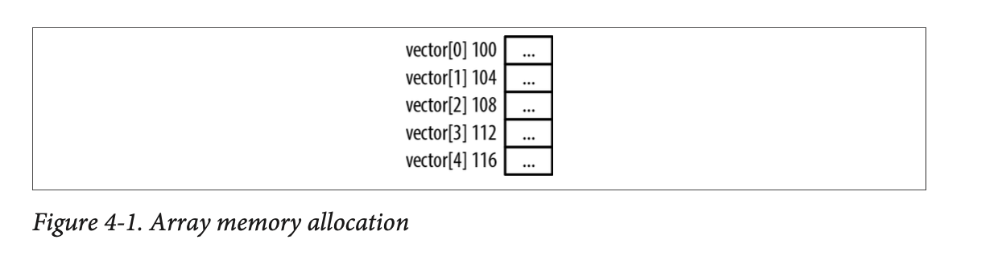
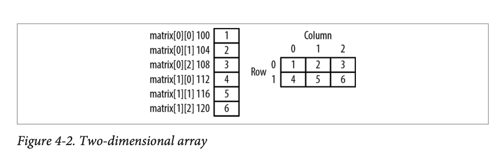

# Arrays and Pointers

## Table of Contents

* [](#)

## Introduction

An **array** is a **contiguous** collection of elements of the **same type** that can be **accessed using an index**. Contiguous means that the elements are adjacent to one another with no gaps in between. 

Arrays can possess multiple dimensions. Two-dimensional arrays are common, and we typically use the terms rows and columns to describe the position of an array element.

Arrays have a **fixed size**. When we declare an array, we need to decided how big it should be. The `realloc()` function and variable length arrays provide techniques for dealing with arrays whose size needs to change.

## One-dimensional Arrays

A one-dimensional array is a linear structure. It uses a single index to access its members. 

```c
int vector[5];
```



The array indexes start with 0, and ends at one less than the declared size. **C does not enforce the bounds of an array**. Using an invalid index can result in unpredictable behavior.

The internal representation of an array has **no information about the number of elements it contains**. The array name simply **references a block of memory**. Using the `sizeof()` operator with an array will return the number of bytes allocated to the array. To determine the number of elements in an array, divide the array's size by the element's size.

```c
int vector[5] = {1, 2, 3, 4, 5};
printf("%d\n", sizeof(vector)/sizeof(int));
```

## Two-Dimensional Arrays

Two-Dimensional arrays use rows and columns to identify array elements. This type of array needs to be **mapped to the one-dimension address space of main memory**. In C, this is achieved by using **row-column ordering sequence**. The array's **first row is placed in memory followed by the second row**, then the third row, and this ordering continues until the last row is placed in memory.

```c
int matrix[2][3] = {{1,2,3}, {4,5,6}};
```

The image below illustrates how memory is allocated for the array. The diagram on the left show show memory is mapped. The diagram on the right shows how it can be viewed conceptually.


